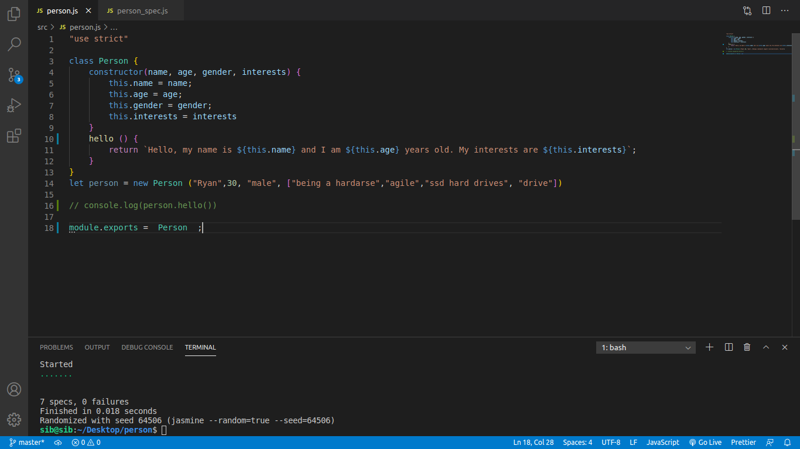

## Object Oriented Programming - (Javascript)
# Person

 - In OOP this is known as abstraction. 
 - We created a simple model of a more complex thing. We only represent the attributes and functionality that we need.

- When an object instance is created from a class, the class’s constructor function is run to create it. This process of creating an object instance from a class is called instantiation — the object instance is instantiated from the class.
- person is an instance of Person

* Topics include: 
- Oop
- TDD jasmine testing
- ES6 standards
- Constructor
- Template literals

# Jasmine to your TDD test
- Jasmine is a behavior-driven development framework for testing JavaScript code. It does not depend on any other JavaScript frameworks. It does not require a DOM. And it has a clean, obvious syntax so that you can easily write tests 
* simply `npm install jasmine-node -g`
* create src and spec folders
* src folder include actual file that has the code and spec folder contains jasmine spec file

 
 
# happy coding!
